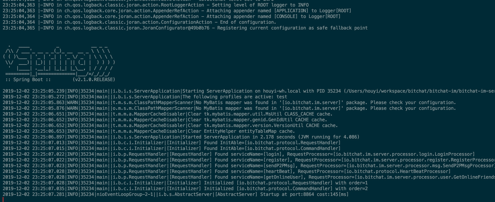
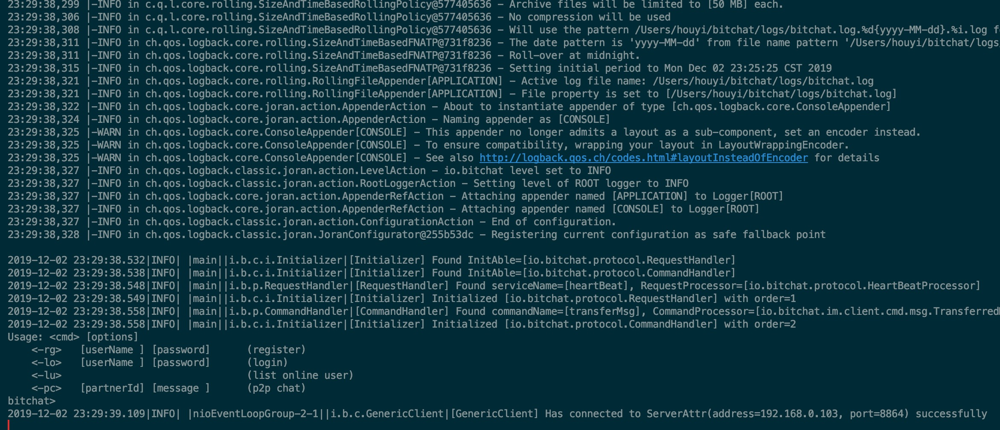
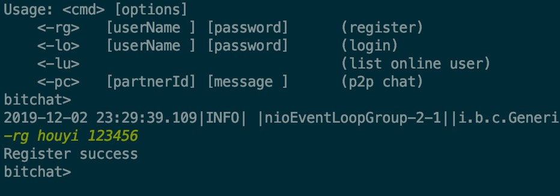
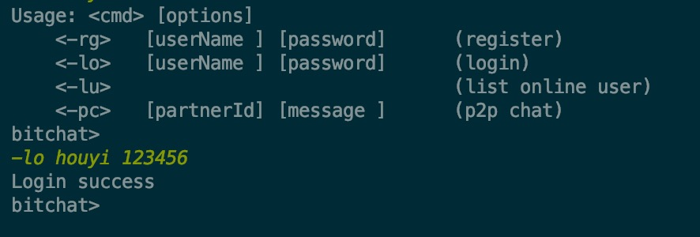
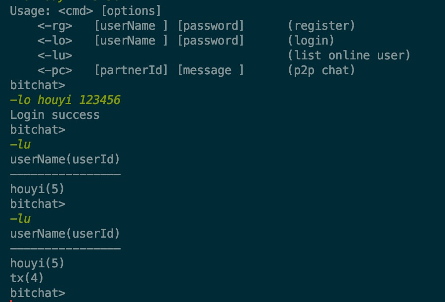
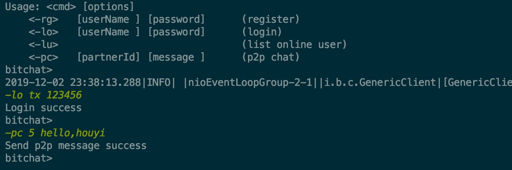
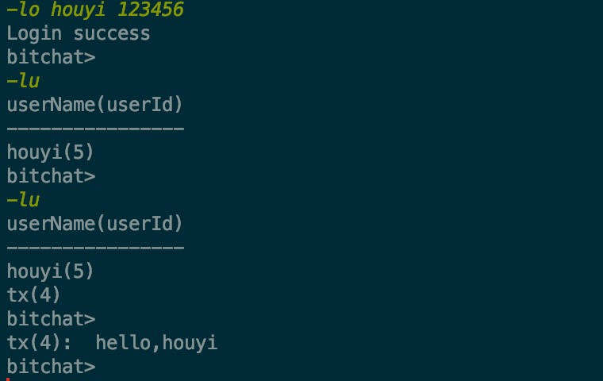
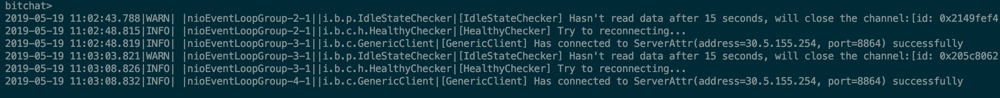

# bitchat-im

**bitchat-im** 是一个基于 bitchat 实现的一个 IM 应用的服务端


## 快速开始

把依赖的 [bitchat](https://github.com/all4you/bitchat) 项目也下载到本地，mvn install 安装到本地的 repository 仓库中

### 安装数据库

可以通过 Docker 快速启用一个mysql数据库，然后创建数据库和相应的数据表，点击查看 [具体细节](bitchat-im-server/src/main/resources/sql/database.sql)

### 启动服务端

要启动服务端，需要获取一个 Server 的实例，可以通过 ServerFactory 来获取。

目前只实现了单机模式下的 Server ，通过 ServerBootstrap 只需要定义一个端口即可获取一个单机的 Server 实例，如下所示：

```java
public class ServerApplication {
    public static void main(String[] args) {
        // 先启动Spring容器
        SpringApplication.run(ServerApplication.class, args);
        // 再启动Server
        ServerBootstrap bootstrap = new ServerBootstrap();
        bootstrap.start(8864);
    }
}
```

服务端启动成功后，将显示如下信息：



###  

### 启动客户端

目前只实现了直连服务器的客户端，通过 SimpleClientFactory 只需要指定一个 ServerAttr 即可获取一个客户端，然后进行客户端与服务端的连接，如下所示：

```java
public class ClientApplication {

    public static void main(String[] args) {
        Client client = SimpleClientFactory.getInstance()
                .newClient(ServerAttr.getLocalServer(8864));
        client.connect();

        ClientService clientService = new ClientService(client);
        clientService.doCli();
    }
}
```

客户端连接上服务端后，将显示如下信息：




#### 体验客户端的功能

目前客户端提供了四种 Func，分别是：注册，登录，查看在线用户列表，发送单聊消息，每种 Func 有不同的命令格式。


##### 注册

通过在客户端中执行以下名 `-rg houyi 123456` 即可实现注册，目前用户保存在 bc_user 表中.

注册成功后，显示如下：



##### 登录

通过在客户端中执行以下命令 `-lo houyi 123456` 即可实现登录。

登录成功后，显示如下：




##### 查看在线用户

再启动一个客户端，并且也执行登录，登录成功后，可以执行 `-lu` 命令，获取在线用户列表，目前用户是保存在内存中，获取的结果如下所示：




##### 发送单聊信息

用 tx 这个用户向 houyi 这个用户发送单聊信息，只要执行 `-pc 5 hello,houyi` 命令即可

其中第二个参数数要发送消息给那个用户的用户id，第三个参数是消息内容

消息发送方，发送完消息：




消息接收方，接收到消息：




#### 客户端断线重连

客户端和服务端之间维持着心跳，双方都会检查连接是否可用，客户端每隔5s会向服务端发送一个 PingPacket，而服务端接收到这个 PingPacket 之后，会回复一个 PongPacket，这样表示双方都是健康的。

当因为某种原因，服务端没有收到客户端发送的消息，服务端将会把该客户端的连接断开，同样的客户端也会做这样的检查。

当客户端与服务端之间的连接断开之后，将会触发客户端 HealthyChecker 的 channelInactive 方法，从而进行客户端的断线重连。




